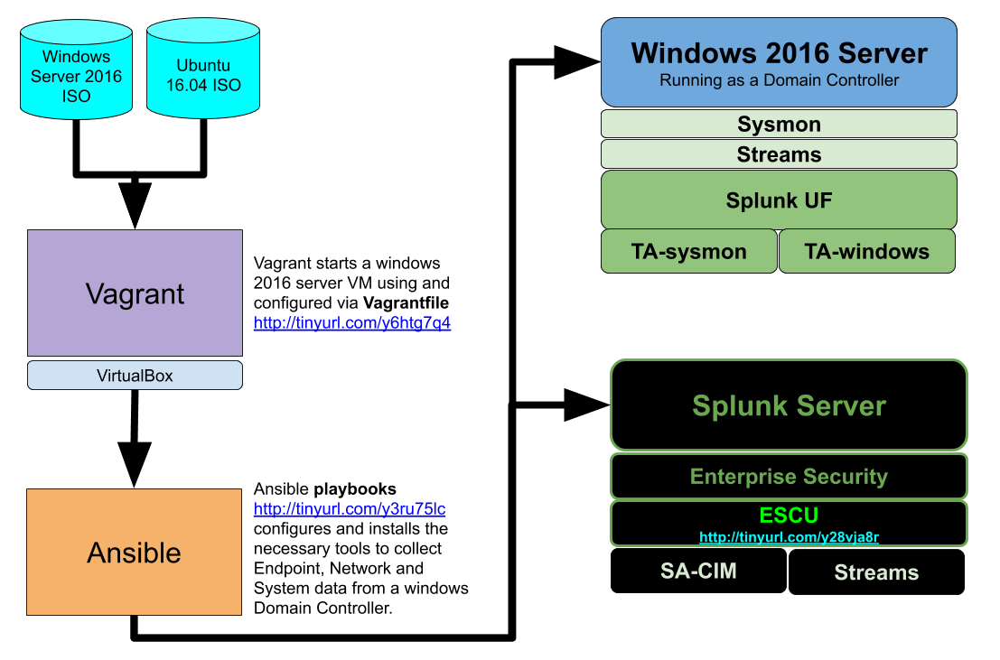

# Building a Windows Domain Controller
A example repo that show how to build a windows 2016 domain controller for attack analsys using Vagrant and Ansible 

# Getting Started
##### 1. Bring up a windows domain controller 

```
cd windows_dc_2016
vagrant up
```

##### 2. Bring up a Splunk instance

```
cd ../splunk_server
vagrant up
```


# Logical Diagram



# Troubleshooting

#### ssh into the splunk_server
To log into the splunk_server box manually:

```
cd splunk_server
vagrant ssh splunk_server
```